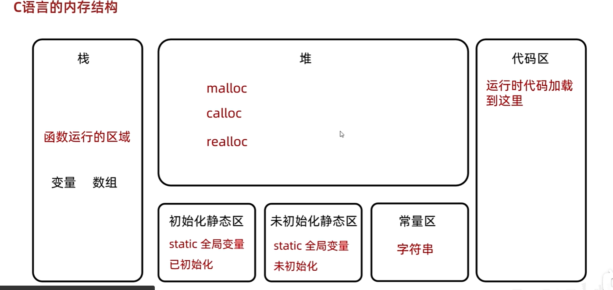

# 动态内存分配

- malloc  申请空间（连续）
- calloc  申请空间 + 数据初始化
- readlloc 修改空间大小
- free 空间

## 使用细节

1. malloc创建空间的单位是字节

2. malloc返回的是void类型的指针，没有步长的概念，也无法获取空间中的数据，需要强转

3. malloc返回的仅仅是首地址，没有总大小，最好定义一个变量记录总大小

4. malloc申请的空间不会自动消失，如果不能正确释放，会导致内存泄露

5. malloc申请的空间过多，会产生虚拟内存
6. malloc申请的空间没有初始化值，需要先赋值才能使用
7. free释放完空间之后，空间中数据叫做脏数据，可能被清空，可能被修改为其他值
8. calloc就是在malloc的基础上多一个初始化的动作
9. realloc修改之后的空间，地址值有可能发生变化，也有可能不会改变，但是原本的数据不会丢失
10. realloc修改之后，无需释放原来的空间，函数底层会进行处理

## C语言内存结构

